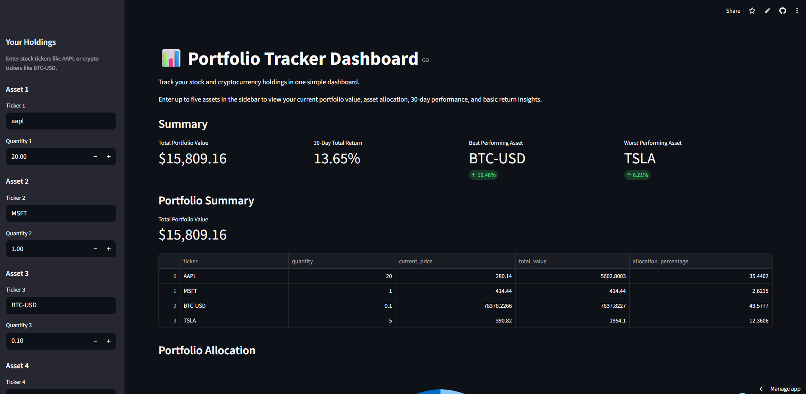

# Portfolio Tracker Dashboard

**Live App:** https://financial-portfolio-tracker-dashboard-szj5s9fm37v55bkuiajgy9.streamlit.app/

A Python and Streamlit dashboard for tracking stock and cryptocurrency holdings.

Users can enter asset tickers and quantities to view current portfolio value, allocation breakdown, 30-day performance, and basic return insights.

## Screenshot



## Features

- Input up to five stock or crypto holdings
- Fetch current asset prices using yfinance
- Calculate current value per holding
- Calculate total portfolio value
- Display portfolio allocation as a donut chart
- Show 30-day portfolio performance as a line chart
- Identify best and worst performing assets over 30 days
- Handle invalid tickers with friendly error messages
- Compare portfolio performance against the S&P 500 using SPY as a benchmark
- Normalise portfolio and benchmark performance to 100 for fair comparison

## Tech Stack

- Python
- Streamlit
- pandas
- Plotly
- yfinance
- CoinGecko API / requests

## What I Learned

This project helped me practise working with real financial data, API-based data fetching, pandas data processing, and dashboard development. I also learned how to separate data logic from user interface code and deploy a data app using Streamlit Community Cloud.

## How to Run Locally

Clone the repository:

```bash
git clone YOUR_GITHUB_REPO_LINK
cd portfolio-tracker-dashboard
```

Create and activate a virtual environment:

```bash
python -m venv .venv
```

Windows:

```bash
.venv\Scripts\activate
```

Mac/Linux:

```bash
source .venv/bin/activate
```

Install dependencies:

```bash
pip install -r requirements.txt
```

Run the app:

```bash
streamlit run app.py
```